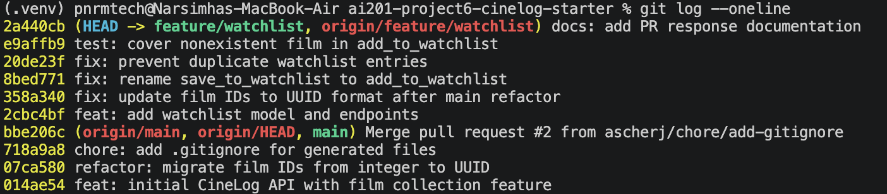

# PR Response Doc — CineLog Watchlist Feature

## AI Usage
I used AI primarily to understand the existing codebase before making changes. I asked AI to explain how add_to_collection() handled deduplication so I could implement the same pattern in the watchlist service. I also used AI to understand the structure of the existing collection tests before writing the required watchlist test, which helped me follow the project's testing style. After completing the required changes, I used AI to review my commit history and confirm that my commit messages followed conventional commit format. I made the final implementation decisions, tested all changes locally, and wrote the design responses myself.

## Comment 1 — Rename
**What I did:**
I renamed save_to_watchlist() to add_to_watchlist() in services/watchlist_service.py and updated the corresponding call in routes/watchlist/watchlist.py so the project follows the existing naming convention used throughout the codebase.

**How I verified:**
I searched the project for save_to_watchlist to locate every call site and confirmed there were no remaining references after the rename. I also ran the test suite to verify that the change did not break any existing functionality.

## Comment 2 — Deduplication
**What I did:**
I added a duplicate check to add_to_watchlist() before creating a new watchlist entry. The function first checks whether the user already has the same film in their watchlist. If a duplicate is found, it raises AlreadyInWatchlistError instead of creating another entry.

**How I verified:**
I followed the existing add_to_collection() implementation in services/collection_service.py so the watchlist behaves consistently with the rest of the application. After making the change, I ran the test suite to confirm that existing functionality still passed.

## Comment 3 — Missing test
**What I did:**
I created tests/test_watchlist.py and added a test that verifies add_to_watchlist() raises FilmNotFoundError when a nonexistent film_id is provided.

**How I verified:**
I modeled the test after test_add_to_collection_nonexistent_film_raises in tests/test_collection.py to follow the project's existing testing style. I ran both the new watchlist test and the full test suite to confirm everything passed.

## Comment 4 — Default visibility
**My position:**
I think watchlists should be public by default.

**Reasoning:**
CineLog is designed as a community film tracking platform where users can discover movies through other people's activity. Making watchlists public by default encourages sharing recommendations and helps users explore films that others are planning to watch. Since a watchlist represents movies a user intends to watch rather than personal ratings or private notes, making it public better supports the social nature of the platform.

**Tradeoff acknowledged:**
Making watchlists private by default would better protect users who prefer to keep their viewing plans personal. However, because CineLog emphasizes film discovery and community interaction, I believe a public default provides more value while still allowing a privacy option to be added in the future if needed.

## Comment 5 — Sort order
**My position:**
I agree that the watchlist should be sorted by date added, with the most recently added films appearing first.

**Reasoning:**
Most users use a watchlist as a running list of movies they plan to watch next rather than as a permanent catalog. Showing the most recently added films first makes it easier to find the movies that are currently on a user's mind and better supports how people typically update and revisit a watchlist.

**Engagement with reviewer's point:**
I agree with the reviewer's point that users usually want to see what they added recently. Alphabetical ordering can make it easier to locate a specific title, but it is less useful for deciding what to watch next. Since CineLog focuses on tracking and discovering films, sorting by date added provides a better default experience while still leaving room for additional sorting options in the future.

## Comment 6 — Rebase
**What conflicted:**
After rebasing my feature/watchlist branch onto origin/main, the only merge conflict occurred in .gitignore because both branches had added the file. The updated main branch also included the refactor that migrated film IDs from integers to UUIDs, which was incorporated into my branch during the rebase.

**How I resolved it:**
I resolved the .gitignore conflict by keeping the generated file ignore rules and completed the rebase. I then verified that my watchlist changes remained compatible with the UUID-based implementation from the updated main branch.

**How I verified no conflict remains:**
I completed the rebase successfully, confirmed that the working tree was clean, ran the test suite to ensure everything still passed, and verified that the commit history remained linear with no merge commits.## PR Description

## Overview
This pull request completes the watchlist feature by addressing all review comments from the code review. The feature allows users to add films to a personal watchlist while preventing duplicate entries and validating that a film exists before it is added. I also added a new watchlist test, rebased the branch onto the updated main branch, and cleaned up the commit history using conventional commit messages.
## Design Decisions
Default Visibility: I chose to keep watchlists public by default because CineLog is designed as a community film-tracking platform where users can discover movies through other users' watchlists. While a private default would better support users who want to keep their viewing plans personal, a public default better supports the platform's social and discovery-focused experience.
## Sort Order: 
I chose to sort watchlists by date added, with the most recently added films appearing first. This makes it easier for users to find the movies they most recently planned to watch and better matches how watchlists are typically used. Although alphabetical ordering can help locate a specific title, date-added ordering provides a more useful default for everyday use.
## Manual Testing
Start the application with python app.py.
Add a valid film to a user's watchlist using the watchlist add endpoint.
Verify the film appears in the user's watchlist.
Attempt to add the same film again and confirm that a duplicate entry is not created.
Attempt to add a nonexistent film_id and verify that the appropriate error is raised.
Run pytest tests/ -v to confirm all tests pass successfully.

## Git Log Screenshot

 